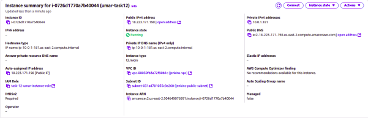
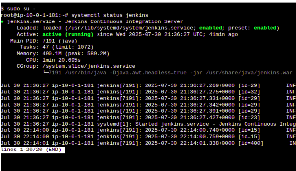
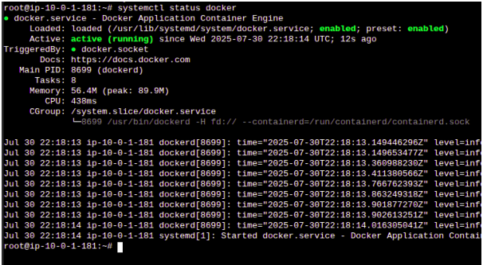
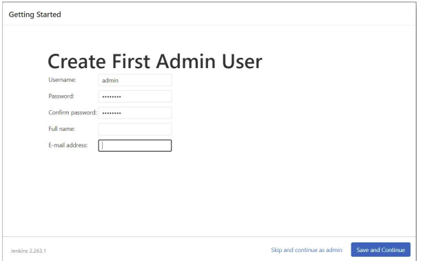
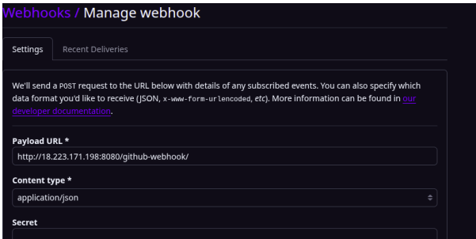
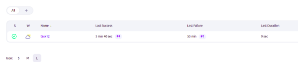
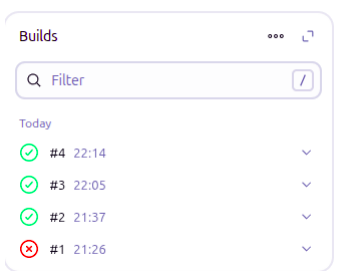
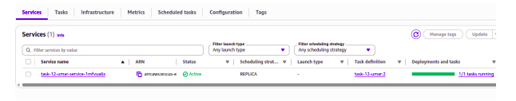
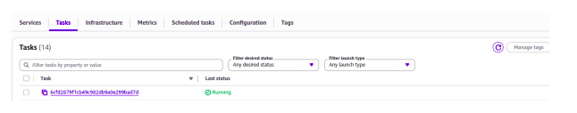

**DEPLOYMENT ON ECS VIA JENKINS TASK** 

This project creates pipeline for creating pipeline that deploys the application automatically over **ECS** via **Jenkins** whenever the code is pushed to GitHub. 
Setting Up Jenkins Agent on an EC2 Instance: 

**Follow the following steps to set up Jenkins Agent on an EC2 Instance:** 

● Go to the IAM service in the AWS Console. 
● Create a new IAM role with the following AWS managed policies: 

   • AmazonEC2ContainerRegistryFullAccess: Full access to ECR (Elastic Container Registry).  
   • AmazonECS_FullAccess: Full access to ECS (Elastic Container Service). 

This role will be attached to your EC2 instance. 
● Launch an EC2 Instance: 
● Launch the instance and make sure that you open the required ports i.e 8080 and 80 in the Security Group of EC2. 

**Install Jenkins, AWS CLI, and Docker on EC2:** 

Once your EC2 instance is up and running, connect to it SSM. Then install Jenkins, AWS CLI, and Docker. After installing them, make sure that Jenkins and Docker Service is running. 

**Configure Jenkins: 

Paste your <Instance Ip>:8080 in the browser and configure your Jenkins. 

Make sure to install the GitHub Integration Plugin and Docker Plugin in your Jenkins. 

**Setting Up a Webhook in GitHub: 

A webhook allows Jenkins to automatically trigger a build whenever you push code to your GitHub repository. Create a webhook in your GitHub repo and configure it with your Jenkins. Make sure to add the necessary permissions in your Jenkins Security tab. 

**Creating a Jenkins Pipeline:**

The Jenkins pipeline automates the process of building a Docker image, pushing it to Amazon ECR, and deploying it to ECS. 

**Trigger the Pipeline:** 

Trigger the pipeline manually and wait for the build to be completed. 

**Trigger via Webhook:**

To trigger the pipeline via webhook, commit a file in Github repo and pipeline will automatically run. In the above picture, build number 4 represents the build that was carried out when pipeline was triggered by webhook. 

**Verify ECS Service Deployment:**

●  In the AWS Management Console, go to ECS (Elastic Container Service). 
●  Select your cluster, then the service (app). 
●  Under the Tasks tab, ensure that new tasks have been launched with the updated Docker image. 

**Application:**

Access the application by the public IP of the task. 

